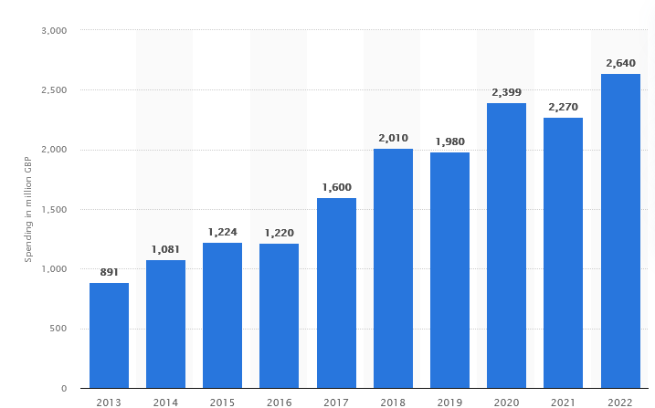

# 1.2 Stakeholders

[Micro:bit Space Invaders](http://localhost:5000/s/TFD8WiLjH6TpVB2WtnKj/ "mention")I'm making a platform fighter as they combine a large amount of the gaming industry's innovations into one game. It can incorporate multiplayer, single player, fast feedback cycles, low time dedication, mastery and if necesarry other aspects like a story or progression through other side elements, but I plan to follow the design of Rivals of Aether, with no story progression.\
\
Gamers' needs and how to appeal to them:\
Free to play\
Easy to pick up\
Small time investment\
Replayable

.png>)\
(urbanemujoe, 2022)

Having a game be mutliplayer is more important than ever. After the Covid-19 pandemic, people used video games as a way to communicate with others, and this hasn't gone away after the pandemic ended. 83% of gamers play online or with others (urbanemujoe, 2022) so having multiplayer appeals to 83% of the target audience. My game will have local multiplayer, but not online multiplayer as I want to keep it free to play and run. However, having no online multiplayer is bad, but as it's a PC game, people can use resources such as Parsec to play together.

Free to play

\
\
As 75% of people regularly use ESRB ratings (urbanemujoe, 2022), having an appropriate, yet low rating is important. Therefore I believe I should use the same ESRB rating as the Smash Bros series, which was rated E for everyone for Super Smash Bros 64, Teen for Super Smash Bros Melee and Super Smash Bros Brawl and E 10+ for Super Smash Bros (Wii U) and Super Smash Bros Ultimate (“Ratings,” n.d.). As the most recent entry in the smash bros series is E 10+, that feels the most suitable. As it's one of the lowest ratings the Smash series has recieved (so has the largest target audience as people of the most ages can play it). This is further shown by Smash Bros Ultimate sharing a rating with Nickelodeon: All Star Brawl and Rivals of Aether.

\
.png>)
