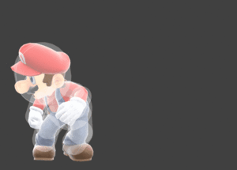
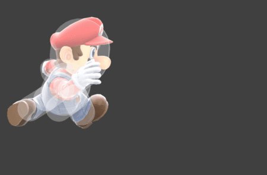
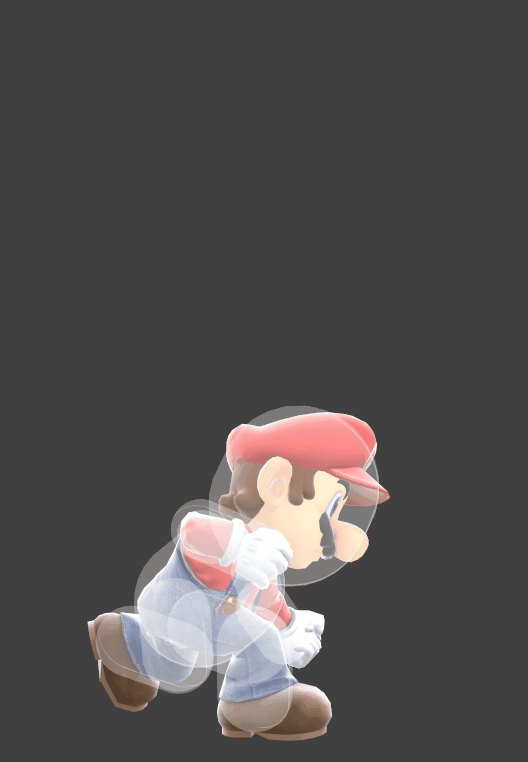
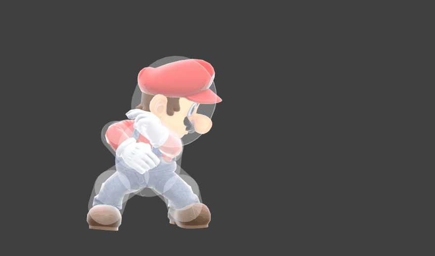
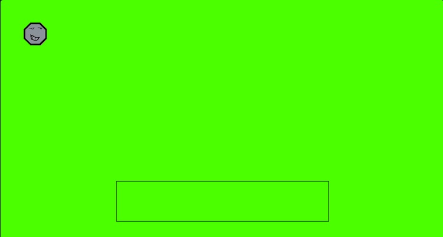

# 1.4a Features of Proposed Solution

## Mechanics

### Player Inputs

#### Controller

I will make my controls based on the UK English and US Standard keyboard layouts with arrow keys (Specifically any qwerty layout with a semicolon next to L and arrow keys) as they're the most common keyboard layouts in English-speaking countries, and as England speaks English, I should make a control set for the most common layout.

<figure><figcaption>
<a href="../reference-list.md">UK Magic Keyboard Layout (Wichary, 2018)</a>
</figcaption></figure>

#### Directional inputs

For directional inputs, I will use WASD and player 1 and arrow keys for player 2. That way, to attack in a specific direction you need to press the key that points in that direction. To move left I will use A and ← respectively. To move right I will use D and → respectively. To fast fall (Increase your falling speed in the air) I will use S and ↓. However I won't use W and ↑ for jumping. This is because jumping is such an important resource, as you only get one midair jump before touching the ground, it needs to be separate from any other input. The arrow keys allow people coming from other PC platform fighters to control player 2, while people coming from mouse and keyboard games or controllers where movement is on the left can control player 1. As the controls are also so simple to pick up with all attacks being around one button, anyone can control either player.

#### Explaining the jump button

The jump key is a very complicated key, as Rivals of Aether has shown us, controls focused around the jump key make for smoother controls due to limiting the hand movement required and ensuring players always have easy access to jump. This means I should use a key for each player that's easily accessible with one hand so that you can have one hand for moving and another for attacking and can have multiple other keys around it so all the controls are close to each other. This needs to be done while ensuring that the players don't get in each other's way, so I need controls that are far away from each other.

#### Other inputs

I've decided for this reason to use G to jump for player 1 and L to jump for player 2. These keys are both very far away from each other and provide a similar placement of other attacking inputs. I can then use F and K for the light attack inputs respectively, H and ";" for the special attack inputs respectively and T and O for the strong attack inputs respectively. This allows both players to have a similar input style for their attack inputs but reversed for each player. This means that players can do light attack inputs and special inputs with their index or ring finger, and their middle finger can press jump or heavy (as you can't do a heavy attack in the air you don't need to press both at once). Lastly, for dodge, I've decided to use Left Shift for player 1 and N for player 2. This is because when using your left hand for "WASD", your pinkie finger is resting over Left Shift and when using your left hand for "OKL;" your pinkie rests over N while staying out of the way of player 1's "TFGH" inputs. This means you don't have to change your positioning to input dodge and the controls feel the same for both players.

<figure><figcaption>
Finalised controls on a UK keyboard layout
</figcaption></figure>

### Functionality of inputs

#### Directional inputs

Directional inputs are very important in platform fighters for both movement and attacks. They are important for movement because pressing left or right makes the character move left and right, pressing down allows for fast falling and all directions direct attacks. This means if you're holding right and need to attack left, you need to stop moving right entirely. This is why jump isn't bound to up as otherwise, you need to jump to attack upward. However, this way of inputting directions makes it easier for newer players as they can clearly see what direction moves are going to go.&#x20;

#### Jumping

Jumping is the most important mechanic and one that's extremely limited. With only one midair jump and the ability to jump while grounded, it makes platform fighters very based on aerial movement. Jumps allow you to avoid grounded hits, reach players that are close to the top of the screen or trying to avoid moves, allow yourself to use aerial moves and most importantly recover to the stage. As you only get one midair jump and you only get it back when you touch the stage, a common strategy is to "edge guard" your opponent by trying to hit them before they get back to the stage, either to hit them further away so they have to use their jump and become vulnerable or if they've already used their jump to launch them far enough away that they can't make it back to the stage due to not having a jump.&#x20;

#### Light attacks

Light attacks are fast attacks, generally having an active hitbox in under 10 frames. They do relatively little damage but combo can into other light attacks or aerials while your opponent hasn't taken much damage. When your opponent has taken more damage, some characters can combo them into kill moves, but they likely won't kill themselves. Some of them can, but they can't combo and are weaker than strong attacks.&#x20;

<figure><figcaption>
<a href="../reference-list.md">Mario's Forward Light in Super Smash Bros. Ultimate (SmashWiki, 2023)</a>
</figcaption></figure>

 

<figure><figcaption>
<a href="../reference-list.md">Mario's Downward Light in Super Smash Bros. Ultimate (SmashWiki, 2023)</a>
</figcaption></figure>

 

<figure><figcaption>
<a href="../reference-list.md">Mario's Upward Light in Super Smash Bros. Ultimate (SmashWiki, 2023)</a>
</figcaption></figure>

#### Strong attacks

Strong attacks are slow attacks that deal much more damage and knockback than normal attacks but take generally over 10 frames to start up. They are normally large moves that cover a bigger area of the stage. They don't combo into other moves and have lots of end lag. This makes them risky moves with higher rewards and most times the way to end lives.&#x20;

<figure><figcaption>
<a href="../reference-list.md">Mario's Downward Heavy in Super Smash Bros. Ultimate (SmashWiki, 2023)</a>
</figcaption></figure>

 

<figure><figcaption>
<a href="../reference-list.md">Mario's Upward Heavy in Super Smash Bros. Ultimate (SmashWiki, 2023)</a>
</figcaption></figure>

 

<figure><figcaption>
<a href="../reference-list.md">Mario's Forward Heavy in Super Smash Bros. Ultimate (SmashWiki, 2023)</a>
</figcaption></figure>

#### Aerial attacks

Aerials are done with the light or heavy attack button while in the air. They are completely different depending on the character. They can kill, be fast, have a large hitbox, combo and deal lots of damage, but they generally only do one of these. They define how a character can play due to either strengthening or weakening their neutral game, balancing the character

<figure><figcaption>
<a href="../reference-list.md">Mario's Forward Aerial in Super Smash Bros. Ultimate, a slow move with a reasonable hitbox that has a high reward (SmashWiki, 2023)</a>
</figcaption></figure>

 

<figure><figcaption>
<a href="../reference-list.md">Mario's Backward Aerial in Super Smash Bros. Ultimate, a fast move with a large hitbox and low reward (SmashWiki, 2023)</a>
</figcaption></figure>

#### Special attacks

Specials, like Aerials, are dependent on the character and are where most of the uniqueness of the character is shown. They can have any potential effect in the game, from launching a projectile, reflecting projectiles, grabbing and throwing opponents and stunning opponents. They add individuality to a character to make them feel separate from every other character. Upward specials are the most important specials, as on top of having a hitbox, they send the user upwards, allowing for a recovery tool if they've used their jump or want to conserve it.

<figure><figcaption>
Mario showcasing recovery options in Super Smash Bros 64
</figcaption></figure>

## Design

### Art Style

Platform fighters need to be simple to understand. Players need to understand where the hitboxes are, what parts of the stage are interactable, what moves their opponent is doing, when a character is in stun, how damaged their opponent is and so much more. For this reason, art styles should be simplistic, so that it's obvious what's happening. This approach is best shown by Rivals of Aether, using 2d sprites for characters and stages with simplistic designs, where hitboxes are highlighted while still making each character feel unique.

<figure><figcaption>
Screenshot from Rivals of Aether
</figcaption></figure>

#### Stage and background

The stage will be basic, a single colour that no character or hitbox shares to differentiate it from other elements. It will have a main platform that covers the centre of the screen and walls that go further down that can be jumped off. The background will be a dark colour to highlight the stage and characters so it's easier to tell where people are.

<figure><figcaption>
Simple concept art for the stage and background
</figcaption></figure>

#### Characters and hitboxes

Characters will be simplistically designed, nothing more than a simple shape with a face on it to show an obvious hitbox and location. Hitboxes will be designed similarly, where every active hitbox is the same colour so it's obvious where the hitbox is and how big it is.

<figure><figcaption>
Concept art of the type of designs I thought would fit
</figcaption></figure>

## Limitations

### Platform support

Being a .exe file once compiled means it only has Windows support without compatibility layers. However, as I can make the code open source people should be able to compile the code themselves.

### Performance

Being run locally means it only runs as well as the machine running it can perform, this shouldn't be an issue as there shouldn't be too much for the hardware to run.

### Online multiplayer

There will be no online multiplayer, but there will be local multiplayer. This in combination with tools like Parsec can allow people to play online multiplayer at no cost to them or me.

### Graphics detail

I'm going to prioritise the gameplay over the looks so the characters and stage will be basic. If I have time I will add animations but I might just keep it as a stationary sprite.
