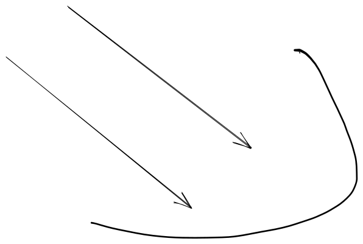

# 1.4a Features of Proposed Solution

## Mechanics

### Directional inputs

I will make my controls based on the UK English and US Standard\
\
For directional inputs, I will use WASD and player 1 and arrow keys for player 2. That way, to attack in a specific direction you need to press the key that points in that direction. To move left I will use A and ← respectively. To move right I will use D and → respectively. To fast fall (Increase your falling speed in the air) I will use S and ↓. However I won't use W and ↑ for jumping. This is because jumping is such an important resource, as you only get one midair jump before touching the ground, it needs to be separate from any other input. The arrow keys allow people coming from other PC platform fighters to control player 2, while people coming from mouse and keyboard games or controllers where movement is on the left can control player 1. As the controls are also so simple to pick up with all attacks being around one button, anyone can control either player.\
\
The jump key is a very complicated key, as Rivals of Aether has shown us, controls focused around the jump key make for smoother controls so we need a key for each player that's easily accessible with your other hand (so you can move and attack at the same time) and can have multiple other keys around it so all the controls are close to each other. \
\
I've decided for this reason to use G for player 1 because I can then use F for the attack input, H for the special attack input and T for the strong attack input. This then allows me to use Shift for shield/dodge as when using WASD for directions, most people's pinkie is hovering over Shift naturally. \
\
With this in mind, as I need to not overlap player 1 and 2's controls or hands, for player 2's jump input I will use L for a similar concept. This keeps the attack inputs a good distance away from player 1's while having a similar jump centralised controls\

## Limitations←→↑↓

### Limitation 1

Description of a limitation, due to scope/time constraints or difficulty of implementation.
