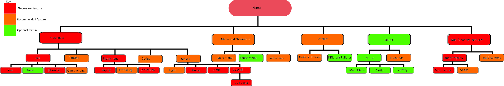

# 2.1 Design Frame

## Systems Diagram

<figure><figcaption></figcaption></figure>

This diagram shows the different parts of the game that I will focus on creating. I have split each section into smaller sub sections. Throughout the development stage, I will pick some of these sections to focus on at a time. I have broken the project down this way as it roughly corresponds to the [success criteria](../analysis/1.5-success-criteria.md). This was done with [computational methods](../analysis/1.4b-computational-methods.md) in mind to make development easier.

## Usability Features

Usability is an important aspect to my game as I want it to be accessible to all. There are 5 key points of usability to create the best user experience that I will be focusing on when developing my project. These are:

### Effective

This means users can achieve the goal with completeness and accuracy. To do this, I will make it easy for the players to realise that they need to reach a goal in order to win the game. I will make this goal clear to see so there is no confusion over what players need to do.

#### Aims

* Make the controls easy to use but make movement precise
* Clearly display lives and percent so each player can see who's winning

### Efficiency

Efficiency refers to the speed and accuracy to which a user can complete the goal. To do this, I will create a menu system which is easy to navigate through in order for to find what you are looking for. The information which is more important can be found with less clicks.

#### Aims

* Create a menu system that is quick and easy to navigate through
* Create a controls system that isn't too complicated but allows the player to do multiple actions

### Engaging

The solution is engaging for the user to use. To do this, I will build the game around the local multiplayer mode as multiplayer keeps players engaged due to the sense of friendly rivalry and friendship. I will also create at least 5 characters with unique move sets to allow battles to be more unique. Having a simple art style allows players to understand what's going on, reducing frustration.

#### Aims

* Create a series of characters that players can play as
* Create a local multiplayer and single player mode
* Incorporate a style of game art the suits the game

### Error Tolerant

The solution should have as few errors as possible and if one does occur, it should be able to correct itself. To do this, I will write my code to manage as many different game scenarios as possible so that it will not crash when someone is playing it.

#### Aims

* The game doesn't crash
* The game does not contain any bugs that damage the user experience

### Easy To Learn

The solution should be easy to use and not be over complicated. To do this, I will create simple controls for the game. I will make sure that no more controls are added than are needed in order to keep them as simple as possible for the players.

#### Aims

* Create a list of controls for the game
* Create a display in the pause menu that shows player controls

## Pseudocode for the Game

### Pseudocode for game

The starting point from the game will be the Chili Framework [(planetchili, 2017)](../reference-list.md#2.1), a framework used to teach people C++ as a part of a set of tutorial series by ChiliTomatoNoodle starting with Beginner C++ Game Programming [(ChiliTomatoNoodle, 2016)](../reference-list.md#2.1). It allows users to begin their learning with a graphical interface and the ability to display pixels on a blank screen that's 800 pixels wide and 600 pixels high.\
\
Being written in only C++ means there's lots of starting code. I'll be starting with a fork of the Chili framework that allows sprites to be used [(planetchili, 2018)](../reference-list.md#2.1). This has lots of foundation, but most of the code will be ran in Game.cpp and Game.h. In C++, files are split up into ccp and h files. Cpp files store the main functions and h files declare variables and functions.

Header files have a structure similar to

```
#pragma once //Only allow one

#include "Keyboard.h" //If needed
#include "Mouse.h" //If needed
#include "Graphics.h" //If needed

class Game
{
public:
	Game( class MainWindow& wnd ); //Defines identifier function
	Game( const Game& ) = delete;
	Game& operator=( const Game& ) = delete;
	void Go();
private:
	void FunctionName(); //Defines a function
	/********************************/
	/*  User Functions              */
	/********************************/
private:
	MainWindow& wnd;
	Graphics gfx;
	/********************************/
	/*  User Variables              */
	/********************************/
	int x;//Define variables
};
```

Cpp files have a structure similar to

```
#include "[Name of header file].h"

Game::Game( MainWindow& wnd )
	:
	wnd( wnd ),//Calls the library for windows functions like keyboard inputs
	gfx( gfx )//Calls the graphics library
{
	//Identifier function, only needed if you need wnd or gfx
}

void Game::Go()
{
	//Callable function either from other functions
}
```
